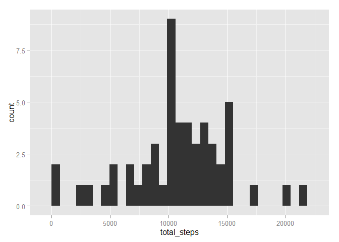
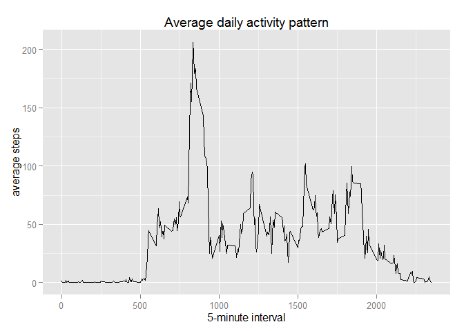
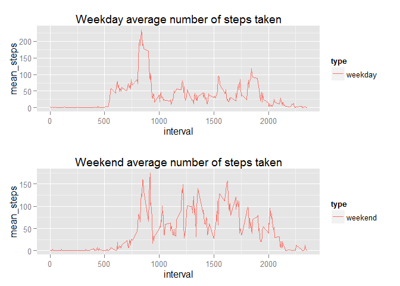

# Reproducible Research: Peer Assessment 1
### Libraries and functions required

```r
library(dplyr)
library(lubridate)
library(ggplot2)
```
### Loading and preprocessing the data

```r
df <- read.csv("activity.csv")
df_na <- df
df <- df %>% filter(!is.na(steps)) %>% mutate(date = ymd(date))
```
### What is mean total number of steps taken per day?
1. Calculate the total number of steps taken per day

```r
df_date <- df %>% group_by(date) %>% summarize(total_steps = sum(steps))
```
2. Histogram of the total number of steps taken each day

```r
g <- ggplot(df_date, aes(x=total_steps))
g + geom_histogram()
```

 

3. mean and median of the total number of steps taken per day


```r
mean(df_date$total_steps)
```

```
## [1] 10766.19
```

```r
median(df_date$total_steps)
```

```
## [1] 10765
```
### What is the average daily activity pattern?
1. Time Series of 5 minutes interval 

```r
df_interval <- df %>% group_by(interval) %>%summarise(mean_steps=mean(steps))
g <- ggplot(df_interval, aes(x=interval, y=mean_steps))
g + geom_line() + xlab("5-minute interval") + ylab("average steps") + ggtitle("Average daily activity pattern")
```

 

2. Which 5-minute interval, on average across all the days in the dataset, contains the maximum number of steps?

```r
df_interval$interval[which.max(df_interval$mean_steps)]
```

```
## [1] 835
```
### Imputing missing values
1. Calculate and report the total number of missing values in the dataset

```r
sum(is.na(df_na))
```

```
## [1] 2304
```
2. filling in all of the missing values in the dataset using the mean of 5-minute interval

```r
getMeanByInterval <- function(x){
    filter(df_interval,interval == x)$mean_steps
}
substituteNas <- function(steps, interval){
    s <- 0
    if (is.na(steps)){
        s <- getMeanByInterval(interval)
    }
    else{
        s<- steps
    }
    s
}
```
3. Create a new dataset that is equal to the original dataset but with the missing data filled in

```r
new_df <- df_na
new_df$steps <- mapply(substituteNas, df_na$steps, df_na$interval)
head(new_df)
```

```
##       steps       date interval
## 1 1.7169811 2012-10-01        0
## 2 0.3396226 2012-10-01        5
## 3 0.1320755 2012-10-01       10
## 4 0.1509434 2012-10-01       15
## 5 0.0754717 2012-10-01       20
## 6 2.0943396 2012-10-01       25
```
4. histogram of the total number of steps taken each day and Calculate and report the mean and median total number of steps taken per day

```r
df_date <- new_df %>% group_by(date) %>% summarize(total_steps = sum(steps))
g <- ggplot(df_date, aes(x=total_steps))
g + geom_histogram()
```

 

```r
mean(df_date$total_steps)
```

```
## [1] 10766.19
```

```r
median(df_date$total_steps)
```

```
## [1] 10766.19
```
Do these values differ from the estimates from the first part of the assignment? 
  Answer: The mean is equal, but the median differs a litle bit.

What is the impact of imputing missing data on the estimates of the total daily number of steps?
  Answer: the mean and the median are more closed after imputing missing data.

### Are there differences in activity patterns between weekdays and weekends?
1. Create a new factor variable in the dataset with two levels - "weekday" and "weekend" indicating whether a given date is a weekday or weekend day.

```r
df <- df %>% mutate(type = ifelse(weekdays(date) == "sábado" | weekdays(date) == "domingo", "weekend", "weekday"))
df$type <- as.factor(df$type)
```

2. A panel plot containing a time series plot (i.e. type = "l") of the 5-minute interval (x-axis) and the average number of steps taken, averaged across all weekday days or weekend days (y-axis)

```r
# Multiple plot function
#
# ggplot objects can be passed in ..., or to plotlist (as a list of ggplot objects)
# - cols:   Number of columns in layout
# - layout: A matrix specifying the layout. If present, 'cols' is ignored.
#
# If the layout is something like matrix(c(1,2,3,3), nrow=2, byrow=TRUE),
# then plot 1 will go in the upper left, 2 will go in the upper right, and
# 3 will go all the way across the bottom.
#
multiplot <- function(..., plotlist=NULL, file, cols=1, layout=NULL) {
    library(grid)
    
    # Make a list from the ... arguments and plotlist
    plots <- c(list(...), plotlist)
    
    numPlots = length(plots)
    
    # If layout is NULL, then use 'cols' to determine layout
    if (is.null(layout)) {
        # Make the panel
        # ncol: Number of columns of plots
        # nrow: Number of rows needed, calculated from # of cols
        layout <- matrix(seq(1, cols * ceiling(numPlots/cols)),
                         ncol = cols, nrow = ceiling(numPlots/cols))
    }
    
    if (numPlots==1) {
        print(plots[[1]])
        
    } else {
        # Set up the page
        grid.newpage()
        pushViewport(viewport(layout = grid.layout(nrow(layout), ncol(layout))))
        
        # Make each plot, in the correct location
        for (i in 1:numPlots) {
            # Get the i,j matrix positions of the regions that contain this subplot
            matchidx <- as.data.frame(which(layout == i, arr.ind = TRUE))
            
            print(plots[[i]], vp = viewport(layout.pos.row = matchidx$row,
                                            layout.pos.col = matchidx$col))
        }
    }
}

df_interval_weekday <- filter(df, type=="weekday") %>% group_by(interval, type) %>% summarize(mean_steps  = mean(steps))

df_interval_weekend <- filter(df, type=="weekend") %>% group_by(interval, type) %>% summarize(mean_steps  = mean(steps))

# First plot

p1 <- ggplot(df_interval_weekday, aes(x=interval, y=mean_steps, colour=type)) +
    geom_line() +
    ggtitle("Weekday average number of steps taken")

# Second plot
p2 <- ggplot(df_interval_weekend, aes(x=interval, y=mean_steps, colour=type)) +
    geom_line() +
    ggtitle("Weekend average number of steps taken")

multiplot(p1, p2)
```

 

